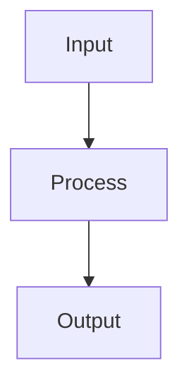

Explain the following code in a clear, educational way:

## Code to Explain
${*}

## Explanation Structure

### 1. Purpose
What does this code do? (1-2 sentences)

### 2. How It Works
Step-by-step breakdown:
1. Start with the entry point
2. Explain each major step
3. Describe the data flow
4. Note any side effects

### 3. Key Concepts
List programming concepts used:
- Design patterns (if any)
- Language-specific features
- Algorithms or data structures

### 4. Visual Diagram
If helpful, provide a Mermaid diagram showing:
- Function call flow, OR
- Class relationships, OR
- Data flow

### 5. Example Usage
Show how to use this code with a simple example.

### 6. Common Pitfalls
Potential mistakes when using or modifying this code.

Adjust the depth of explanation based on code complexity. For simple code, keep it brief.
